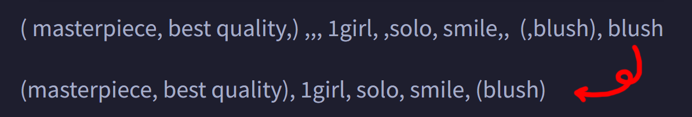
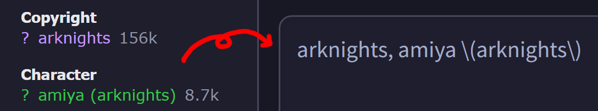

# SD Webui Prompt Format
This is an Extension for the [Automatic1111 Webui](https://github.com/AUTOMATIC1111/stable-diffusion-webui), which helps formatting prompts.

> Compatible with [Forge](https://github.com/lllyasviel/stable-diffusion-webui-forge)

<p align="center">
<br>
Sometimes, when you type too fast or copy prompts from all over the places, you end up with duplicated <b>spaces</b> and <b>commas</b>. This simple Extension helps removing them whenever you click <b>Generate</b>.
</p>

<br>

## Features
- [x] Works in both `txt2img` and `img2img`
- [x] Works in both `Positive` and `Negative`, as well as `Hires. fix` prompts
- [x] Remove extra **spaces** and **commas**
- [x] Fix misplaced **brackets** and **commas**
- [x] Enable `Remove Duplicates` to remove identical tags found in the prompts
  - **Note:** Only works for tag-based prompt, not sentence-based prompt
    - **e.g.** `1girl, solo, smile, 1girl` will become `1girl, solo, smile`
    - **e.g.** `a girl smiling, a girl standing` will not be changed
- [x] Enable `Remove Underscores` to replace `_` with `space`
- [x] Respect line breaks
  - `Remove Duplicates` only checks within the same line
- [x] Append a comma every line break
- [x] Toggle between auto formatting and manual formatting
  - In `Auto` mode: The process is ran whenever you click on **Generate**
  - In `Manual` mode: The process is only ran when you click the **Format** button
- [x] Pressing `Alt` + `Shift` + `F` can also manually trigger formatting
- [x] Format the text pasted from clipboard

<br>

- [x] Toggle whether the above features are enabled / disabled by default in the `Prompt Format` section under the <ins>System</ins> category of the **Settings** tab
- [x] Exclude specific tags from `Remove Underscores`
- [x] Assign "[alias](#tag-alias)" that counts as duplicates for the specified tags
- [x] Click `Reload` to refresh the 2 settings above

> [!Note]
> Some Extensions *(**eg.** [tagcomplete](https://github.com/DominikDoom/a1111-sd-webui-tagcomplete))* listen to the text editing event, meaning the formatting will cause them to be triggered. You can disable updating the actual prompts in the settings to prevent this.

<details>
<summary><b>Booru</b></summary>

- [x] Clean up unwanted texts when pasting tags from Booru sites
  - Currently supports [gelbooru](https://gelbooru.com/) and [danbooru](https://safebooru.donmai.us/)

<p align="center"></p>

</details>

<br>

### Tag Alias
- You can assign other tags that count as the same as the main tag, which then get removed during `Remove Duplicates`
- The syntax is in the format of `main tag: alias1, alias2, alias3`
  - **example:**
    ```
    1girl: girl, woman, lady
    ```
    - If you type `girl`, it will get converted into `1girl`, which will get removed if the prompt already contains `1girl`

- The pattern for alias uses **Regular Expression**, so certain symbols *(**e.g.** `(`, `)`)* will need to be escaped *(**i.e.** `\(`, `\)`)*
  - Comma is not supported, as it is used to separate multiple patterns
