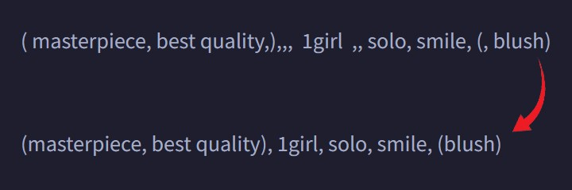

# SD Webui Prompt Format
[[English](README.md)|中文]

這是一個[Automatic1111 Webui](https://github.com/AUTOMATIC1111/stable-diffusion-webui)的插件，用來幫忙校正咒語。

> 亦支援 [SD.Next](https://github.com/vladmandic/automatic) 與 [Forge](https://github.com/lllyasviel/stable-diffusion-webui-forge) !

<p align="center"></p>

有時候如果打字太快或是從各處東拼西湊咒語，常會造成多個重複的空格或逗點。這個擴充可以幫忙移除它們。

## 功能
- [x] 在`txt2img`和`img2img`都有用
- [x] 對`正面`和`負面`以及`Hires. fix`之咒語都有用
- [x] 移除多餘的**空格**和**逗點**
- [x] 修正錯誤的**括弧**
- [x] 開啟`Remove Duplicates`會把咒語中重複的單字消除
  - **注意:** 只對單字類咒語有效
    - **例.** `1girl, solo, smile, 1girl` 會變成 `1girl, solo, smile`
    - **例.** `a girl smiling, a girl standing` 則不變
- [x] 開啟`Remove Underscores`會將 `_` 換成 `空格`
- [x] 保留咒語的換行
  - 上述的`Remove Duplicates`只在同一行中有效
- [x] 按下`Auto Format`以在手動與自動間切換
  - `自動`: 每次按下 **生成 (Generate)** 時處裡
  - `手動`: 手動按下 **Format** 時才處裡
- [x] 在 **Settings** 頁面 <ins>System</ins> 下的 `Prompt Format` 區可以 開啟/關閉 上述功能
- [x] 按下 `Alt` + `Shift` + `F` 亦可觸發格式化
- [x] 為指定單字新增 "[同義詞](#同義詞)"
- [x] 將指定字詞除外 `Remove Underscores` 的影響
- [x] 點擊 `Reload Cached Cards & Alias` 以重新載入
  - 在一開始， `ExtraNetwork` 中的卡片會被緩存一次以防被 `Remove Underscores` 影響。如果你在 Webui 仍在運行時加入更多的卡片，點擊此按鈕來重新緩存。

### 同義詞

<p align="right"><i><b>新功能</b> 🔥</i></p>

- 在 `Prompt Format` 的設定裡，有個新的 **Tag Alias** 欄位
- 你可以在此把其它字詞設為主單字的同義詞，使其在 `Remove Duplicates` 中被當作重複字而刪去
- 格式為 `main tag: alias1, alias2, alias3`
  - **範例:**
    ```
    1girl: girl, woman, lady
    ```
    - 如果輸入 `girl`, 便會轉換成 `1girl`; 而如果 `1girl` 已經存在，多餘的便會被刪除。

- 同義詞判斷使用 **Regular Expression**，故特定文字 *(**如.** `(`, `)`)* 便需要被跳脫 *(**即.** `\(`, `\)`)*
  - 逗號用來分開多個同義詞，故無法用於同義詞
  - 可參考 [RegExr](https://regexr.com/) 以便學習
  - **範例:**
    ```regex
    adult: \d*\s*(y\.?o\.?|[Yy]ear[s]? [Oo]ld)
    ```
    - 此便會將 `15 yo`, `20 y.o.`, `25 years old`, `30 Year Old` 都轉為 `adult`

<hr>

### 注意
1. 由於 `自動`校正 和 生成 是同時觸發，當下所生產的第一張圖片之咒語可能不會是已更新的。

2. 有些擴充 *(如. [tagcomplete](https://github.com/DominikDoom/a1111-sd-webui-tagcomplete))* 追蹤文字的編輯事件，意即文字校正會導致它們啟動。你可以到設定關閉咒語的自動更新。
