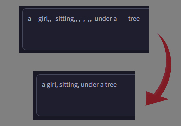

# SD Webui Prompt Format
[[English](README.md)|中文]

這是一個[Automatic1111 Webui](https://github.com/AUTOMATIC1111/stable-diffusion-webui)的插件，可以幫忙校正咒語。

> 示範圖

有時候打字太快，或是從各地東拼西湊咒語，常造成多個重複的空格或逗點。這項插件可以幫忙移除它們。

## 功能實作
- [x] **[New]** 你可以打開`prompt_format.js`並把上面的`static UseCN = false;`改成`static UseCN = true;`來套用中文翻譯
- [x] 在`txt2img`和`img2img`都有用
- [x] 移除多餘**空格**和**逗點**
- [x] 修改錯誤的**括弧**
- [x] 開啟`Remove Duplicates`會把咒語中重複的單詞消除
  - **注意:** 只對單詞類咒語有效
    - **例.** `1girl, solo, smile, 1girl` 會變成 `1girl, solo, smile`
    - **例.** `a girl smiling, a girl standing` 則不變
- [x] 開啟`Remove Underscores`會將 `_` 換成**空格**
  - *一些較新的動漫模型聲稱不用再加底線*
- [x] 保留咒語的換行
  - **注意:** 上述的`Remove Duplicates`只在同一行中有效
- [x] 按下`Ctrl + \`來跳脫目前游標所在的單字
  - 平時，**括弧**是用來強調單字。所以若使用像是`mejiro mcqueen (umamusume)`的咒語，便必須跳脫成`mejiro mcqueen \(umamusume\)`
- [x] 按下`Auto Format`以在手動與自動間切換
  - `自動`: 每次按下 **生成 (Generate)** 時處裡
  - `手動`: 手動按下`Format`時才處裡
- [x] **[New]** 按下`Update Input`以開/關格式套用[^1]
  - 有些擴充 *(**如.** [tagcomplete](https://github.com/DominikDoom/a1111-sd-webui-tagcomplete))* 訂閱文字的編輯事件，意即我的格式化會導致它們啟動
  - 基本上，只有在有安裝上述擴充時才需要關閉這個功能
    - 你可以打開`prompt_format.js`並把上面的`static updateInput = true;`改成`static updateInput = false;`來永久關閉
  - 在`關閉`時，前述的美化只是視覺效果。唯有再次手動編輯後，咒語才會更新

[^1]: 由於透過`JavaScript`而非`Python`撰寫，生成圖片的內部資料只會在下一次生成才更新。這個選項主要影響，當你按下`Send to img2img`時所傳送的咒語是否已美化過等等。